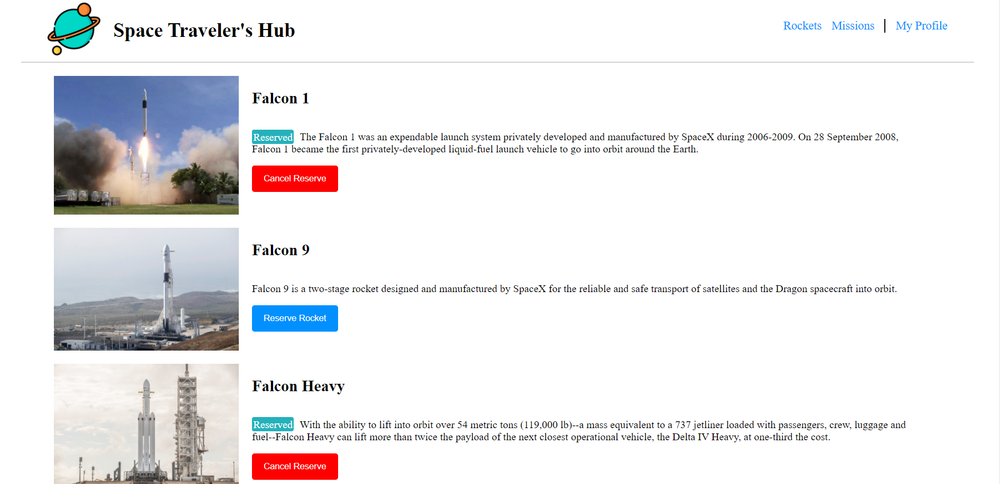

# Space-Travelers-Hub

> Space Traveler's Hub is a single page web application that fatches rockets, missions from the SpaceX API. Users can book and cancel their reservations for rockets and missions. Application has three pages Rockets/Missions/MY Profile, My Profile page shows the list of reserved rockets and missions.

## Screenshots:




## Built With

- HTML
- CSS
- JavaScript
- REACT
- Redux
- Webpack
- Jest

## Online live link

[Visit project online](https://space-travelers-thecodechaser.netlify.app)

## Getting Started

To get a local copy up and running follow these simple example steps.

### Prerequisites
- A text editor(preferably Visual Studio Code)
- Node
- Web browser

### Install
- [Git](https://git-scm.com/downloads)
- [Node](https://nodejs.org/en/download/)

### Using it Locally

- Clone the project

```bash 
git clone https://github.com/thecodechaser/space-travelers-hub

cd space-travelers-hub
```

- Install dependencies

```bash
npm i 
or
npm install
```
- To Start the development server
```bash
npm start
```

- To test the project
```bash
npm run test
```


## Visit And Open Files

[Visit Repo](https://github.com/thecodechaser/space-travelers-hub)

## Download Repo

[Download Repo](https://github.com/thecodechaser/space-travelers-hub/archive/refs/heads/main.zip)

## Authors

👤 **Ranjeet Singh**

- GitHub: [@githubhandle](https://github.com/thecodechaser)
- Twitter: [@twitterhandle](https://twitter.com/thecodechaser)
- LinkedIn: [LinkedIn](https://linkedin.com/in/thecodechaser)

👤 **Kalolo Chola Lemba**

- GitHub: [@KayLemba](https://github.com/KayLemba)
- Twitter: [@King-Kaylo1](https://twitter.com/King_Kaylo1) 
- LinkedIn: [@kalolo-lemba](https://www.linkedin.com/in/https://www.linkedin.com/in/kalolo-lemba-41a8339a/-41a8339a/)


## 🤝 Contributing

Contributions, issues, and feature requests are welcome!

Feel free to check the [issues page](https://github.com/thecodechaser/space-travelers-hub/issues).

## Show your support

Give a ⭐️ if you like this project!

## Acknowledgments

- Inspiration: Microverse

## 📝 License

This project is [MIT](./MIT.md) licensed.
